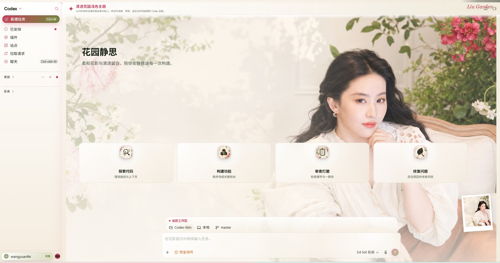
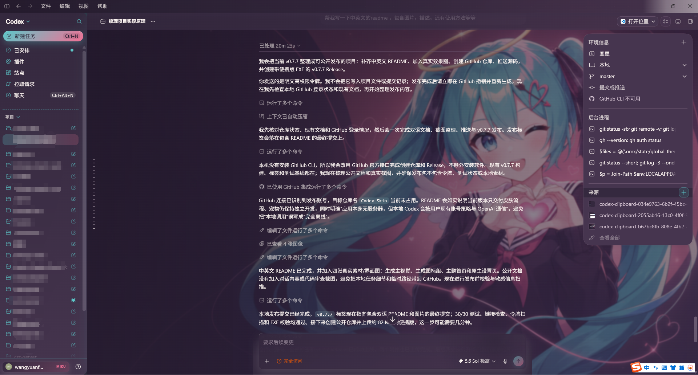
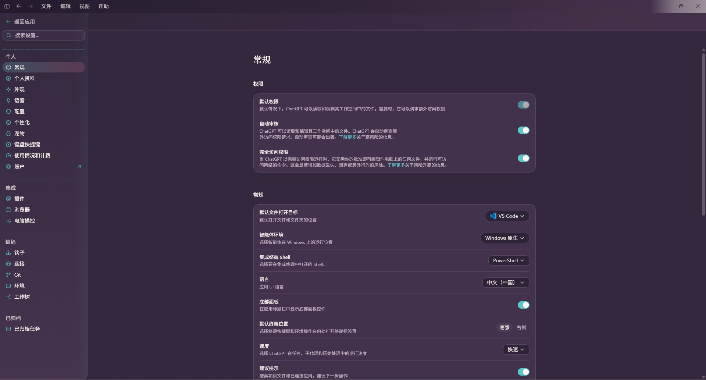
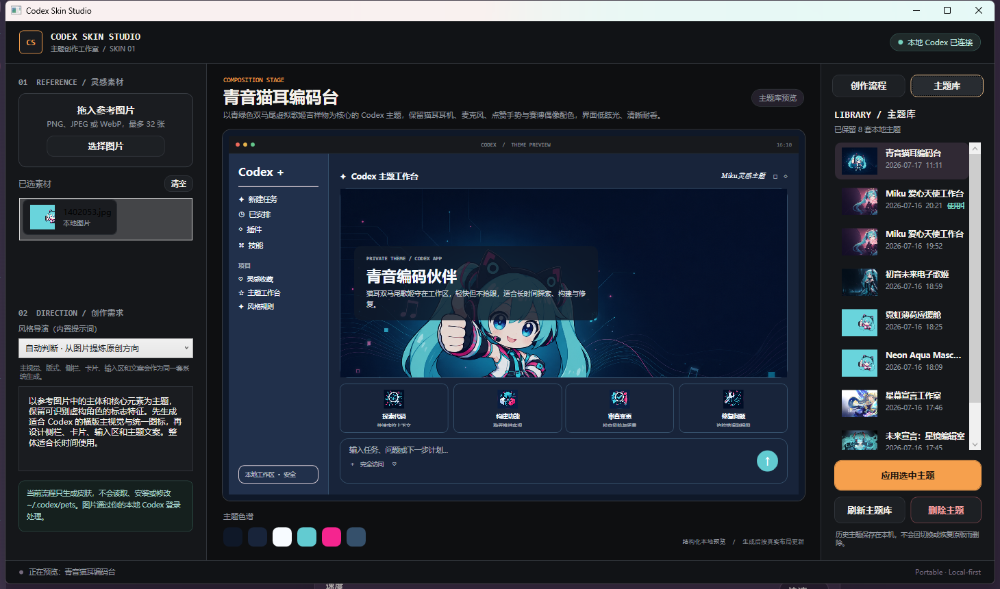

<h1 align="center">Codex Skin Studio</h1>

<p align="center"><strong>把喜欢的角色、色彩与氛围，变成你每天都想打开的 Codex 工作台。</strong></p>

<p align="center">一组参考图，加上一段你自己的描述，就能生成彼此呼应的主视觉、图标、配色与界面文案。不是简单换一张壁纸，而是让首页、对话、侧栏、输入区、设置页和弹窗都属于同一个世界。</p>

<p align="center"><strong><a href="https://github.com/wangyuanfei-9527/Codex-Skin/releases/latest">下载最新 Windows 便携版</a></strong> · <a href="./README.md">English</a></p>

<p align="center"><code>单文件 EXE</code> · <code>无需安装</code> · <code>使用本机 Codex</code> · <code>可预览</code> · <code>可随时恢复</code></p>



> 这是 Codex Skin Studio v0.7.8 实际应用到 Codex 后的界面，不是概念图。你看到的主视觉、四枚图标、配色和文案都由同一组参考素材生成；换一组素材，就会得到一套全新风格的工作台。

## 不是“贴一张背景图”，而是重做整套氛围

大多数主题只改变背景，真正使用时，侧栏、按钮、卡片和设置页依然各自为政。Codex Skin Studio 会先理解参考图中真正重要的东西——角色身份、标志性特征、色彩、光线、构图与装饰元素——再统一设计整套界面。

- **主题从首页延伸到工作流。** 对话、代码、审查、Diff、应用内菜单、浮层、设置和编辑器使用同一套语义色彩。
- **素材是成套生成的。** 横版主视觉和四枚小尺寸图标共享同一种视觉语言，不拿原图裁切冒充成品。
- **文案也会进入主题。** 标题、副标题、功能卡片、输入框提示、项目名称和签名可以一起改写。
- **你始终掌握最后决定。** 先看完整预览，满意再应用；不满意可以继续生成、切换历史主题，或随时恢复原版。

### 从首页到编码现场，都保持沉浸

主题不会在你打开任务后消失。背景、内容区、输入框、右侧环境信息和文字对比度会一起适配，同时保留 Codex 原有的布局与操作习惯。



### 连原生设置页，也是一套完整的颜色系统

不是只照顾最容易截图的欢迎页。设置、菜单、弹窗、审查和 Diff 等原生界面也会继承经过验证的主题变量，让长时间使用仍然清晰、统一。



## 三步做出你的第一套主题

1. **放入灵感。** 选择一张或多张角色图、插画、配色参考或情绪图。
2. **说清你想保留什么。** 描述主体、气质、构图、文案方向，以及绝对不能丢失的识别特征。
3. **选择界面明暗。** 使用“自动 / 明亮 / 暗色”决定基础表面和正文的明暗关系。
4. **预览，然后应用。** 工作室生成主视觉、图标、色板和文案；你可以只生成预览，也可以直接应用并重启 Codex。


生成不是一个黑盒按钮。创作台会展示参考素材、创作要求、当前阶段、主题色板和接近真实 Codex 布局的预览。只有完整素材通过尺寸、结构、哈希、路径和作用域校验后，主题才允许被应用；缺图或无效结果会直接停止，不会悄悄降级成廉价替代品。

## 灵感不会被下一次生成覆盖

每套成功生成的主题都会自动进入本机主题库。你可以随时重新预览和切换，无需重新生成。正在使用的主题受到删除保护；恢复原版 Codex 也不会清空你的收藏。



## 现在开始

### 使用条件

- Windows 10 或 Windows 11，x64
- 已安装 Microsoft Store 版 Codex 桌面应用（当前版本的注入目标）
- 已安装并登录 Codex CLI，在 PowerShell 中运行 `codex --version` 可以正常返回
- 当前 Codex 账号或工作区具备所选生成流程需要的能力

### 快速使用

1. 从 [Releases](https://github.com/wangyuanfei-9527/Codex-Skin/releases/tag/v0.7.8) 下载 `CodexSkinStudio-v0.7.8-Windows-x64.exe`。
2. 双击运行，无需安装，也不需要另填 API Key。
3. 选择参考图，写下创作要求。
4. 点击**只生成皮肤预览**先看效果，或点击**生成皮肤并应用**直接完成整套流程。
5. 想换回去时，点击**恢复原版 Codex**即可；你的主题库仍会保留。

**[下载 Codex Skin Studio v0.7.8](https://github.com/wangyuanfei-9527/Codex-Skin/releases/tag/v0.7.8)**

## 本地优先，不等于模糊数据边界

Codex Skin Studio 没有自己的后端、账号系统、遥测、统计分析、上传接口、内置密钥或第三方模型服务。任务、生成素材、主题包、备份和状态保存在：

```text
%LOCALAPPDATA%\CodexSkinStudio
```

应用会调用你已经安装并登录的 `codex` 命令。参考图片、提示词和生成请求可能会按照你的 Codex 账号及工作区策略发送给 OpenAI；它们不会经过 Codex Skin Studio 的服务器——项目本身没有服务器。应用不会读取或复制你的 Codex 凭据。完整说明见 [PRIVACY.md](./PRIVACY.md)。

## 它会改什么，又刻意不改什么

主题覆盖侧栏、导航、项目与任务行、首页主视觉、功能卡片、输入区、滚动条、选中色、代码块、对话、审查、Diff、设置、应用内菜单、浮层、对话框和编辑器中已经验证的界面变量。

Windows 原生标题栏与菜单、未知控件、真实登录用户名、核心导航名称、用户任务、插件、凭据和宠物窗口会保持原样。当前 v0.7.8 专注于把皮肤流程做好；宠物创作仍保持独立，不会用通用占位物冒充生成结果。

<details>
<summary><strong>命令行使用</strong></summary>

桌面应用是推荐入口，仓库也保留了同一套校验流程的 CLI：

```powershell
node .\bin\codex-skin.mjs doctor
node .\bin\codex-skin.mjs generate-skin --image C:\path\one.png --requirements "制作一套保留角色标志特征的主题" --color-mode light --output C:\path\bundle
node .\bin\codex-skin.mjs validate C:\path\bundle
node .\bin\codex-skin.mjs apply-skin C:\path\bundle --restart
node .\bin\codex-skin.mjs restore-skin --restart
```

仓库内还包含 `$build-codex-skin` skill，可在 Codex 任务中运行同一套阶段化流程。

</details>

<details>
<summary><strong>从源码构建</strong></summary>

需要 Node.js 22+、64 位 .NET Framework C# 编译器及相关程序集：

```powershell
npm run verify
powershell -ExecutionPolicy Bypass -File .\scripts\build-windows-app.ps1
```

单文件程序会输出到 `dist\CodexSkinStudio.exe`。

</details>

<details>
<summary><strong>v0.7.8 校验信息</strong></summary>

此版本通过 31 项自动化检查，并完成工作台明亮模式、暗色模式、自定义标题栏、下拉框和滚动条的真实界面视觉检查。

便携版 EXE SHA-256：

```text
1A91B4849CC484A91914BE87E10F7CCA52A35D4752B783D66EE57A084B0486DA
```

</details>

## 常见问题

- **提示找不到本地 Codex：**先在 PowerShell 中运行 `codex --version`，确认命令可用且已经登录，再重新打开工作室。
- **生成在预览前停止：**查看界面的阶段提示。缺失、损坏或不符合规范的素材会让流程主动停止，不会应用残缺主题。
- **仍然显示旧主题：**在主题库中重新应用选中主题，让 Codex 使用当前主题包重启。
- **无法删除某个主题：**它正在使用中。先应用其他主题，或恢复 Codex 原版。
- **部分 Windows 区域没有变化：**系统原生区域和未经验证的控件有意保留，避免越界修改。

## 项目文档

- [产品原则](./PRODUCT.md)
- [隐私边界](./PRIVACY.md)
- [第三方声明](./THIRD_PARTY_NOTICES.md)
