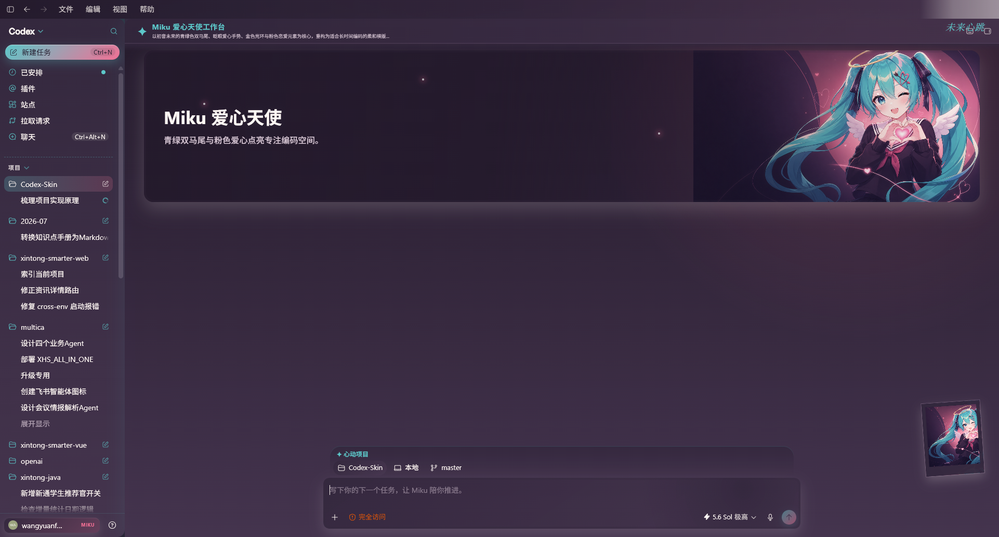
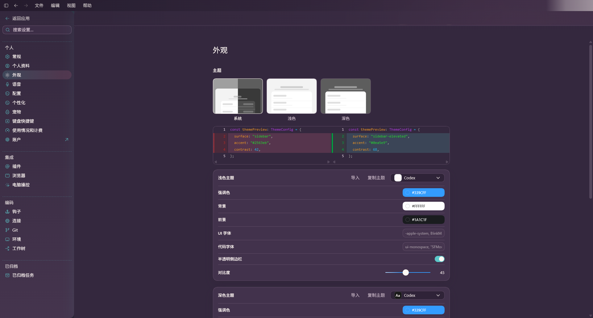

# Codex Skin Studio

简体中文 · [English](./README.md)

> 一款本地优先的 Windows Codex 主题创作工作室。把用户提供的图片组和需求，转换为生成式主视觉、配套图标、主题文案和可随时恢复的 Codex 桌面皮肤。

[下载最新便携版 EXE](https://github.com/wangyuanfei-9527/Codex-Skin/releases/latest)



## 它能做什么

Codex Skin Studio 直接使用**用户电脑上已经安装并登录的 Codex CLI**。它不内置模型、不要求额外 API Key，也不会把文件发送到 Codex Skin Studio 自己的服务器。

每个皮肤都会经过固定流程：

1. 从参考图片中提取主体、角色身份、标志性特征、色彩、构图、光线、装饰元素、必须保留的细节和素材风险。
2. 把分析结果和用户需求合并成完整皮肤规范，并一次性规划所有视觉素材的提示词。
3. 调用用户本地 Codex 的能力，生成 16:10 主视觉和风格统一的 2×2 图标组。
4. 校验图片尺寸、数据结构、文件哈希、路径和 CSS 作用域，通过后才生成预览。
5. 只允许完整有效的主题包进入应用阶段；注入、重启和恢复都保持可逆。

这样可以避免“原图加一层颜色、图标还是默认样式”的廉价效果：先理解图片，再规划整套素材，最后才生成和注入。

## 主要功能

- **单文件 Windows 便携版**：一个 EXE，双击即用，不需要安装，内部已包含 Node 运行时。
- **使用用户本地 Codex**：不内置模型，也不接入第三方模型服务。
- **识别参考图核心元素**：当用户明确要求某个虚构角色时，会保留角色身份和标志性特征，而不是只提取颜色。
- **生成主视觉和完整图标组**：不会在生成失败时偷偷把原图当成最终素材。
- **覆盖完整工作区**：侧栏、标题区、项目/任务、主视觉、功能卡片、输入区、弹窗、设置、审查页、代码块和选中色等都能进入同一主题系统。
- **生成配套文案**：主标题、副标题、项目名称、四张卡片、输入框提示、个人徽标和签名可以统一风格。
- **主题库管理**：每次成功生成的主题都会保存在本地，可随时预览和切换。
- **安全删除**：Codex 当前正在使用的主题不允许删除。
- **一键恢复**：恢复 Codex 原始外观时不会删除主题库。
- **失败即停止**：素材缺失、无关、损坏或不符合规范时停止流程，不应用残缺皮肤。

> **当前范围：** v0.7.7 正式交付独立皮肤流程。宠物生成继续保持分离开发，达到同样的质量和校验标准后再合并；当前版本不会再用通用毛线团之类的占位宠物敷衍结果。

## 效果图

### 生成的视觉素材

| 生成的 16:10 主视觉 | 生成的 2×2 图标组 |
| --- | --- |
|  |  |

### 应用到 Codex 后的界面

| 主题首页 | 原生外观设置 |
| --- | --- |
|  |  |

截图使用了一套用于验收的 Miku 风格主题。实际生成的图片、文案、配色和图标会根据用户提供的参考图与需求变化。

## 使用条件

- Windows 10 或 Windows 11，x64
- 已安装 Codex 桌面应用
- 已安装 Codex CLI，可以通过 `codex` 命令运行，并已经登录
- 当前 Codex 账号或工作区具备所选生成流程需要的能力

便携版 EXE 只包含工作室运行时和确定性编译器，**不包含** Codex、模型、API Key 或用户凭据。

## 快速使用

1. 从 [Releases](https://github.com/wangyuanfei-9527/Codex-Skin/releases/tag/v0.7.7) 下载 `CodexSkinStudio-v0.7.7-Windows-x64.exe`。
2. 双击 EXE，无需安装。
3. 添加一张或多张本地参考图片。
4. 描述希望保留的主体、风格、构图、文案方向和必须可识别的细节。
5. 选择**生成皮肤并应用**完成整套流程，或选择**只生成皮肤预览**先检查结果。
6. 在预览中检查主视觉、四个生成图标、配色、文案和 Codex 实际布局。
7. 点击应用。工作室会重启 Codex，并注入已经通过校验的主题。

进入**主题库**可以打开任意历史主题、无需重新生成就直接切换，也可以删除不再需要的主题。标记为“使用中”的主题受到保护；需要先切换到其他主题，或恢复 Codex 原版，才能删除它。

## 可以修改的范围

v0.7.7 会对经过验证的 Codex 界面进行主题化，包括：

- 应用侧栏、导航、新建任务、项目分组、任务列表和个人区域；
- 首页标题区、品牌、签名、主视觉及裁切、标题、副标题、四张功能卡片和生成图标；
- 项目选择器、输入区、提示文案、发送按钮、滚动条、选中色、引用和代码块；
- 对话页、审查页、Diff、设置页、菜单、浮层、对话框、提示框和编辑器中已验证的主题变量；
- 跟随真实输入框位置响应式移动的右下角装饰图，缩放窗口时不会跳到错误锚点。

Windows 原生标题栏和菜单、未验证控件、真实登录用户名、核心导航名称、用户凭据、任务数据、插件和宠物窗口会保持原样。

## 隐私与本地数据

Codex Skin Studio 没有后端、统计分析、遥测、上传接口、内置密钥或第三方模型服务。任务副本、生成素材、主题包、备份和运行状态保存在：

```text
%LOCALAPPDATA%\CodexSkinStudio
```

应用会在用户现有登录状态下启动本机的 `codex` 命令。参考图片、提示词和生成请求**可能会按照用户的 Codex 账号及工作区策略发送给 OpenAI**。Codex Skin Studio 不会再经过自己的服务器，因为项目没有服务器；用户凭据也不会被读取或复制。完整边界请查看 [PRIVACY.md](./PRIVACY.md)。

## 命令行使用

推荐直接使用桌面应用。仓库也保留了同一套严格校验流程的命令行入口：

```powershell
node .\bin\codex-skin.mjs doctor
node .\bin\codex-skin.mjs generate-skin --image C:\path\one.png --requirements "制作一个明确可识别的 Miku 主题" --output C:\path\bundle
node .\bin\codex-skin.mjs validate C:\path\bundle
node .\bin\codex-skin.mjs apply-skin C:\path\bundle --restart
node .\bin\codex-skin.mjs restore-skin --restart
```

仓库内还包含 `$build-codex-skin` skill，可在当前 Codex 任务中使用。它遵循同样的阶段化流程：先分析和规划，再生成图片，最后确定性编译。

## 从源码构建

需要 Node.js 22+ 以及项目当前使用的 Windows 构建工具。

```powershell
npm run verify
powershell -ExecutionPolicy Bypass -File .\scripts\build-windows-app.ps1
```

单文件程序会输出到 `dist\CodexSkinStudio.exe`。

## v0.7.7 更新内容

这个版本把主题覆盖扩展到了更多 Codex 原生界面，并提升了页面切换后的稳定性：

- 语义颜色现在会覆盖原生控件、菜单、浮层、编辑器、设置页、审查页和 Diff 界面；
- Codex 在导航时替换主区域或侧栏后，主题绑定会自动恢复；
- 对延迟出现的 Diff Shadow Root 进行有限次数重试，避免局部保持原色；
- 明确需要浅色显示的预览区域和开关圆点会保留正确对比度；
- 30 项自动化检查全部通过，并完成首页、对话、审查、个人菜单以及全部 19 个设置分区的真实界面视觉检查。

便携版 EXE 的 SHA-256：

```text
1B5F0E0F4D7DD948953084827F20951F16F60C3625DD1DADD33BA369220BC29F
```

## 常见问题

- **找不到本地 Codex：**在 PowerShell 中运行 `codex --version`，确认命令可用并完成登录，然后重新打开工作室。
- **生成在预览前停止：**查看界面显示的阶段错误。素材无效或缺失时流程会主动停止，不会降级成低质量结果。
- **仍然显示旧主题：**打开主题库，重新应用选中的主题，让 Codex 使用当前主题包重启。
- **主题无法删除：**它正在使用中。请先切换其他主题，或恢复 Codex 原版。
- **某个 Windows 区域没有变化：**操作系统原生区域和未经验证的控件不在注入范围内，这是有意的安全边界。

## 项目文档

- [产品原则](./PRODUCT.md)
- [隐私边界](./PRIVACY.md)
- [第三方声明](./THIRD_PARTY_NOTICES.md)
